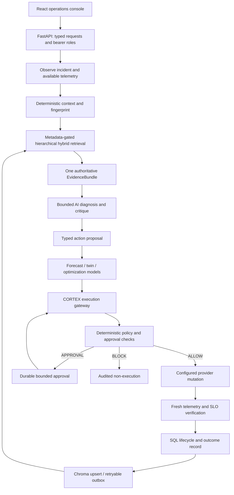

# Architecture and operational boundaries

## Control loop

CORTEX extends the existing control plane. The animated React console calls one FastAPI backend; no separate mock control plane is introduced.

**Invariant:** AI proposes, CORTEX authorizes, the executor mutates, and the verifier determines recovery. Retrieval never authorizes actions.

## Retrieval and knowledge

`backend/retrieval` owns context, fingerprints, filtering, stage orchestration, hybrid ranking and lifecycle-aware memory writing. `backend/rag` retains the existing MiniLM embeddings, Chroma persistence and canonical incident/runbook documents.

Search starts with exact signatures and progressively widens from strict context to related operational knowledge. Service identity is a temporary scope preference and ranking signal; it is not a universal exclusion boundary. Hard constraints such as schema, document visibility and explicit environment boundaries remain in force.

Semantic candidates from Chroma are merged by document ID with lexical candidates from SQLite FTS. Candidates expose semantic, lexical, context, recency, trust, outcome and final scores, plus explanations. The SQL copy is rechecked so an out-of-date semantic index cannot override current visibility or lifecycle state.

One bundle is passed from the main pipeline to the agent. Legacy direct callers may request their own bundle through the compatibility facade. Retrieved text is untrusted evidence, never a higher-priority model instruction.

## Storage and lifecycle

| Store | Authority |
| --- | --- |
| SQL | Operational incidents, operations, approvals, governance state, idempotency, canonical memory documents and pending index writes. |
| Chroma | Searchable semantic index, metadata schema and index revision. Reconstructible from canonical records. |
| JSONL | Audit/export and legacy compatibility; not the primary normal incident-memory retrieval source. |
| Source JSON/Markdown | Bundled historical incident/runbook corpus. Never deleted by an index rebuild. |

A command returning success means only that the command completed. Verification classifies recovery using post-action telemetry and SLOs. Missing/stale metrics do not establish recovery. Unverified model hypotheses do not become trusted incident history.

Verified failed actions remain valuable negative evidence. Knowledge relevance and remediation success are separate scores; a failed action can be relevant while being a poor recommendation. Failed semantic writes remain pending in SQL for replay. Index migration builds and verifies a replacement collection and retains the previous one as a recovery backup.

SQLite/FTS is the implemented storage target. An environment variable alone does not establish Postgres support for every retrieval/authorization query. Multiple distributed writers and high-volume deployment require further concurrency and load validation.

## AI and security

NVIDIA is the primary configured external model provider. The provider registry also supports Gemini, OpenAI, Anthropic, CheaperInference, Ollama and heuristic fallback. Purpose routing uses actual provider/model requests. HTTP failures, rate limits, circuit state and fallback are surfaced; fallback is visibly degraded.

Provider secrets are backend-only. API bearer tokens are separate credentials with viewer, operator and administrator roles. Read routes are private by default apart from explicitly public health/documentation routes. Governance controls require administrator access. A role token authenticates a caller; it does not bypass CORTEX policy.

Approvals bind the incident/proposal, target, action, parameters, proposal version and resource version. They expire and are consumed atomically once. Execution checks current policy again rather than treating approval as permanent authority. The kill switch, capability contracts and gateway validation remain deterministic.

The current role system is a single-instance application boundary, not enterprise SSO or multi-tenancy. The audit chain detects modification relative to the retained chain; it does not make a writable local file immutable or independently notarized.

## What is live and what is modeled

- The local sandbox runs real HTTP service threads in one Python process. Payment, database and cache behavior, latency, error rates and replica counts are modeled; host process CPU/memory and request counters are measured.
- Configured topology expresses known application relationships. It is not automatic cloud inventory discovery.
- Forecast training data and digital-twin behavior are model inputs/outputs. Confidence bands are not a guarantee of production accuracy.
- Cost/carbon calculations are estimates from configured assumptions. They are not measured billing savings or live grid feeds.
- AWS, Azure, GCP and Kubernetes names do not establish a connected production executor. Report adapter connection state and reject unsupported operations.
- No NVIDIA request is called successful merely because a key exists. Only a non-fallback live inference response proves that specific call worked.

## Packaging

The frontend production artifact includes JavaScript/CSS motion code and local assets. Vercel hosts the static build from `frontend/dist-static`; the Python service runs separately. Browser settings may select the backend URL and hold a console token in memory, never an inference key.

The backend is launched as `backend.api_server:app` from the repository root. Docker copies both `backend` and `sandbox`, installs CPU inference dependencies, pre-caches MiniLM, and runs as a non-root user. One worker avoids duplicated sandbox startup and competing local process ownership.

Liveness, database/index readiness and external AI availability are separate signals. The proposed Render configuration places SQL, Chroma and operational logs on a persistent volume. Disk capacity and compute sizing still require workload validation; the included configuration is not a claim of a successful cloud deployment.
